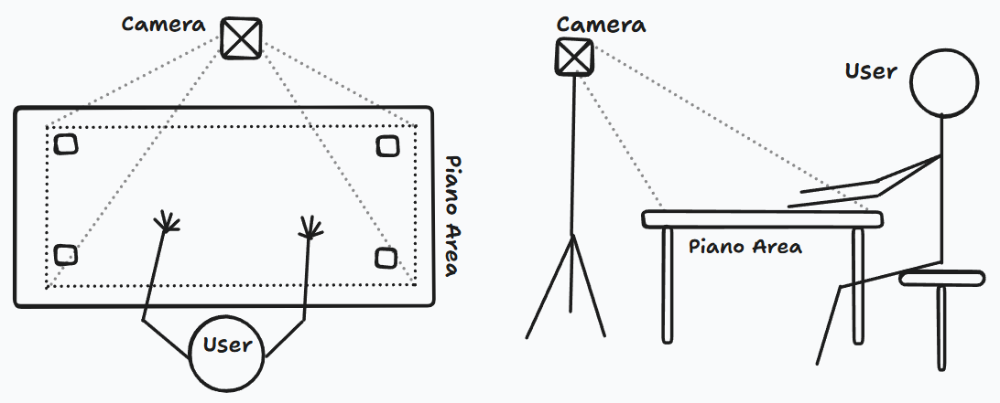
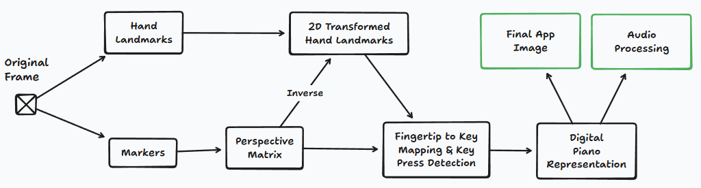
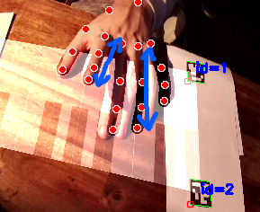

# Apparatus

To replicate the setup you need **4** 6x6 Aruco markers, a camera, a computer and a flat surface.  
The camera should be positioned in front of the user, facing the piano area at a downward angle.   
The Aruco markers should be placed anywhere in the area that the camera sees forming a rectangle.  
As long as the camera can see all markers and is looking at them at a downward angle of roughly `45°`, the application will work as intended.  
You can optionally place the markers at the corners of an actual piano, print a piano keyboard on a piece of paper, or simply use the application window as a reference (it draws a piano keyboard).

# Pipeline

## Aruco Marker Detection

## Hand Landmark Detection

## Inverse Hand Landmark Perspective Transformation

## Fingertip to Key Mapping

## Key Press Detection

The blue arrows indicate the distance delta that we use to detect if a piano key is pressed or not.  
If a short distance delta followed by a long distance delta is detected, we assume that the key was pressed because the distance gets shorter when the user lifts their finger thanks to the camera angle. This method is not ideal but suffices for a proof of concept, in a real application more camera angles, capacitive sensors or other methods would be used to detect key presses more reliably.

Mediapipe does support 3D hand landmark detection which we tried extensively but it ultimately had too much noise and was not suitable to reliably track clicks.

# Design Decisions